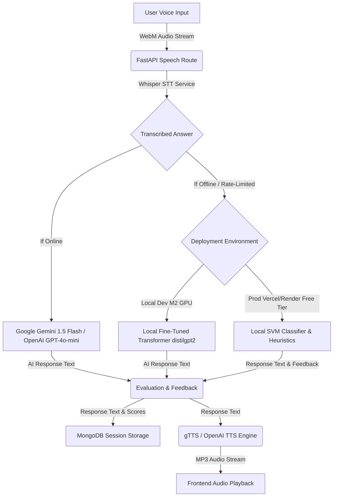

# 🎙️ Voice AI Interview Assistant

A full-stack AI-powered mock interview platform that lets you practice technical interviews using your voice. Speak your answers, get AI interviewer responses read aloud, and receive real-time feedback scores.

> **Resume-worthy project** — demonstrates AI/ML integration, REST APIs, React hooks, voice APIs, and database persistence in a clean, intermediate-level codebase.

---

## 🚀 Demo Features

| Feature | Description |
|---|---|
| 🎙️ Voice Input | Speak answers using your mic (Whisper AI transcribes) |
| 🤖 AI Interviewer | GPT/Gemini asks DSA, HR, and System Design questions |
| 🔊 Voice Output | AI responses are read aloud via gTTS / OpenAI TTS |
| 📊 Feedback Scores | Real-time scoring on technical accuracy, clarity, confidence |
| 🧠 Local ML Mode | Support Vector Machine (SVM) model trained from scratch to evaluate answers offline |
| ⏱️ Rate-Limit Timer | Real-time countdown UI when hitting Gemini/OpenAI API rate limits |
| 🎨 Glassmorphic Input | Liquid glass send button changing states dynamically (Blue -> Yellow -> Red) |
| 💾 Session Memory | Conversation context preserved across turns |
| ✍️ Typing Mode | Switch between voice and text input |
| 🌓 Dark UI | Glassmorphism design with gradient animations |

---

## 🏗️ Tech Stack

### Frontend
- **React 18** — functional components, hooks
- **Tailwind CSS** — utility-first styling
- **React Router v6** — client-side routing
- **Axios** — HTTP client
- **MediaRecorder API** — browser-native audio capture

### Backend
- **FastAPI** — async Python REST API
- **OpenAI Whisper** — local speech-to-text
- **gTTS / pyttsx3** — text-to-speech
- **OpenAI GPT / Google Gemini** — AI interview responses
- **MongoDB + Motor** — async database for session history

---

## 📁 Folder Structure

```
voice-ai-interview/
├── frontend/
│   ├── public/
│   │   └── index.html
│   ├── src/
│   │   ├── components/
│   │   │   ├── Navbar.jsx          # Top navigation
│   │   │   ├── MicButton.jsx       # Voice record button with waveform
│   │   │   ├── ChatBubble.jsx      # Message bubbles with feedback
│   │   │   ├── TypingIndicator.jsx # AI thinking animation
│   │   │   ├── ModeSelector.jsx    # DSA / HR / System Design picker
│   │   │   └── FeedbackPanel.jsx   # Score display panel
│   │   ├── pages/
│   │   │   ├── HomePage.jsx        # Landing page
│   │   │   └── InterviewPage.jsx   # Main interview UI
│   │   ├── hooks/
│   │   │   ├── useVoiceRecorder.js # MediaRecorder hook
│   │   │   └── useInterview.js     # Interview session logic
│   │   ├── services/
│   │   │   └── api.js              # Axios API calls
│   │   ├── App.jsx
│   │   └── index.css
│   ├── package.json
│   ├── tailwind.config.js
│   └── .env.example
│
└── backend/
    ├── main.py                     # FastAPI app + CORS
    ├── config.py                   # Pydantic settings
    ├── requirements.txt
    ├── .env.example
    ├── models/
    │   └── schemas.py              # Pydantic request/response models
    ├── routes/
    │   ├── speech.py               # POST /api/speech/transcribe
    │   ├── ai_response.py          # POST /api/ai/chat
    │   ├── tts.py                  # POST /api/tts/synthesize
    │   └── history.py              # GET/DELETE /api/history/{session_id}
    ├── services/
    │   ├── whisper_service.py      # Whisper STT logic
    │   ├── ai_service.py           # OpenAI / Gemini integration
    │   ├── tts_service.py          # gTTS / pyttsx3 logic
    │   └── feedback_service.py     # Response scoring
    └── utils/
        └── database.py             # MongoDB (Motor) connection
```

---

## 🔄 Voice-AI Pipeline Architecture

The platform operates on a robust, sequential pipeline that coordinates frontend capturing, server-side transcription, AI/ML generation, and speech synthesis:



1. **Speech-to-Text (STT):** Captures microphone audio using the browser's native `MediaRecorder` API (WebM) and sends it to `/api/speech/transcribe` for local Whisper transcription.
2. **Interviewer Response (Cloud LLM vs Local Hybrid Fallback):** 
   - **Online:** Generates tailored follow-up questions using Gemini or OpenAI cloud engines.
   - **Offline / Rate-Limited Fallback:** Automatically switches to offline mode based on your environment:
     - **Local Developer Environment (Apple Silicon MPS):** Runs inference on a custom fine-tuned **Generative Causal Transformer Model (`distilgpt2`)** cached and run locally on Apple Metal GPU (`mps`).
     - **Production Environment (Render / Vercel Free Tiers):** Gracefully falls back to a lightweight **Support Vector Machine (SVM) Classifier** and key-phrase routing to fit within the 512MB RAM constraints and avoid OOM crashes.
3. **Response Evaluation:** Grades technical accuracy, clarity, and confidence metrics (via LLM or local TF-IDF + SVM vector space inference).
4. **Text-to-Speech (TTS):** Synthesizes the generated response into an MP3 stream using the configured TTS engine (gTTS or OpenAI Audio API) for instant playback.

---

## 🧠 Local ML & Transformer Model Training (Offline Mode)

The platform supports offline mock interviews using both generative transformers and lightweight classifiers.

### 1. Generative Transformer Model (Fine-Tuned `distilgpt2`)
A causal language model fine-tuned on custom structured prompt-completion pairs of interview questions.
- **Hardware Acceleration:** Native PyTorch MPS (`mps`) backend for Apple Silicon M2 GPU acceleration.
- **Training Script:** `backend/train_transformer.py`
- **Output Directory:** `backend/resources/fine_tuned_gpt2/`
- **How to Train:**
  ```bash
  source .venv/bin/activate
  python backend/train_transformer.py
  ```

### 2. Machine Learning Classifier (SVM)
A fast, lightweight classification pipeline mapping answers to Correct (2), Partial (1), or Incorrect (0) classes, ideal for production/hosting deployment where memory is restricted.
- **Vectorizer:** TF-IDF Vectorizer (ngram range: 1 to 2) to capture technical terms.
- **Classifier:** Linear SVM Classifier.
- **Training Script:** `backend/train_model.py`
- **Output Directory:** `backend/resources/` (`svm_classifier.pkl` & `tfidf_vectorizer.pkl`)
- **How to Train:**
  ```bash
  source .venv/bin/activate
  python backend/train_model.py
  ```

---

## ⚙️ Installation & Setup

### Prerequisites

- Python 3.10+
- Node.js 18+
- MongoDB (local or Atlas)
- ffmpeg (required by Whisper)

### 1 — Install ffmpeg

```bash
# macOS
brew install ffmpeg

# Ubuntu / Debian
sudo apt install ffmpeg

# Windows — download from https://ffmpeg.org/download.html
```

### 2 — Clone the project

```bash
git clone https://github.com/yourusername/voice-ai-interview.git
cd voice-ai-interview
```

### 3 — Backend setup

```bash
cd backend

# Create and activate virtual environment
python -m venv venv
source venv/bin/activate        # Windows: venv\Scripts\activate

# Install dependencies
pip install -r requirements.txt

# Copy and configure environment variables
cp .env.example .env
```

Edit `backend/.env`:

```env
AI_PROVIDER=openai                          # "openai" or "gemini"
OPENAI_API_KEY=sk-...                       # from platform.openai.com
GEMINI_API_KEY=AIza...                      # from aistudio.google.com
MONGODB_URL=mongodb://localhost:27017       # or Atlas URL
MONGODB_DB_NAME=voice_interview_db
TTS_ENGINE=gtts                             # "gtts" or "pyttsx3"
```

> **No API key?** The app still runs with demo responses — great for UI testing.

### 4 — Frontend setup

```bash
cd frontend

# Install dependencies
npm install

# Copy environment file
cp .env.example .env
```

Edit `frontend/.env`:

```env
REACT_APP_API_URL=http://localhost:8000
```

---

## ▶️ Running the Project

### Start MongoDB (if running locally)

```bash
mongod --dbpath ~/data/db
```

### Start the Backend

```bash
cd backend
source venv/bin/activate
uvicorn main:app --reload --port 8000
```

API will be live at: `http://localhost:8000`  
Docs available at: `http://localhost:8000/docs`

### Start the Frontend

```bash
cd frontend
npm start
```

App will open at: `http://localhost:3000`

---

## 🔌 API Reference

| Method | Endpoint | Description |
|--------|----------|-------------|
| `POST` | `/api/speech/transcribe` | Upload audio → get transcript |
| `POST` | `/api/ai/chat` | Send message → get AI response + feedback |
| `GET` | `/api/ai/modes` | List interview modes |
| `POST` | `/api/tts/synthesize` | Text → MP3 audio stream |
| `GET` | `/api/history/{session_id}` | Fetch session history |
| `DELETE` | `/api/history/{session_id}` | Clear session |
| `GET` | `/health` | Health check |

### Example: Chat Request

```bash
curl -X POST http://localhost:8000/api/ai/chat \
  -H "Content-Type: application/json" \
  -d '{
    "message": "What is a binary search tree?",
    "session_id": "abc-123",
    "mode": "dsa",
    "history": []
  }'
```

### Example: Transcribe Audio

```bash
curl -X POST http://localhost:8000/api/speech/transcribe \
  -F "audio=@recording.webm"
```

---

## 🛠️ Environment Variables

### Backend (`backend/.env`)

| Variable | Default | Description |
|----------|---------|-------------|
| `AI_PROVIDER` | `openai` | `"openai"` or `"gemini"` |
| `OPENAI_API_KEY` | — | OpenAI API key |
| `GEMINI_API_KEY` | — | Google Gemini API key |
| `MONGODB_URL` | `mongodb://localhost:27017` | MongoDB connection string |
| `MONGODB_DB_NAME` | `voice_interview_db` | Database name |
| `MAX_HISTORY_MESSAGES` | `10` | Context window size |
| `TTS_ENGINE` | `gtts` | `"gtts"` or `"pyttsx3"` |

### Frontend (`frontend/.env`)

| Variable | Default | Description |
|----------|---------|-------------|
| `REACT_APP_API_URL` | `http://localhost:8000` | Backend URL |

---

## 🎯 Interview Modes

| Mode | Focus | Question Examples |
|------|-------|-------------------|
| **DSA** | Data structures, algorithms, complexity | Arrays, linked lists, trees, DP, sorting |
| **HR** | Behavioral, STAR method, soft skills | Teamwork, conflict resolution, career goals |
| **System Design** | Architecture, scalability, trade-offs | URL shortener, chat app, social feed |

---

## 📊 Feedback Scoring

After each answer, the app scores:

- **Technical Accuracy** (40%) — domain keyword coverage
- **Communication Clarity** (30%) — sentence structure, length
- **Confidence Level** (30%) — avoidance of hedging language

---

## 🐛 Troubleshooting

**Microphone not working?**
- Allow microphone permissions in browser
- Use Chrome or Firefox (best MediaRecorder support)
- Check browser console for errors

**Whisper model slow on first load?**
- Normal — Whisper downloads the model (~74MB for `base`) on first run
- Subsequent runs are fast

**No AI response?**
- Check `OPENAI_API_KEY` or `GEMINI_API_KEY` is set in `backend/.env`
- Without a key, demo responses are returned automatically

**MongoDB connection error?**
- Ensure MongoDB is running: `mongod --dbpath ~/data/db`
- Or use MongoDB Atlas and update `MONGODB_URL`
- The app works without MongoDB (history features disabled)

**ffmpeg not found?**
- Whisper requires ffmpeg to process audio
- Install via your system package manager (see Installation step 1)

---

## 🚀 Future Improvements

- [ ] User authentication (JWT)
- [ ] Interview timer and session replay
- [ ] Export interview transcript as PDF
- [ ] Question difficulty progression
- [ ] WebSocket for real-time streaming responses
- [ ] Mobile app (React Native)

---

## 📄 License

MIT License — free to use, modify, and distribute.

---

*Built as a portfolio project demonstrating full-stack development with AI/ML integration.*
